# sts_bt_library

## Overview

This module contains the behavior tree implementation for distributed robotic applications. It contains implementation for control flow of different action based command structures (behavior) and ros communication channels for a simple integration of user-nodes. 

### Publications, used work & special thanks

* https://github.com/jrfonseca/xdot.py - graph visualisation tool 
* https://github.com/leethomason/tinyxml2 - xml parser for dynamically parsing .graphml
* https://github.com/miccol/Behavior-Tree - original core mechanics of behavior tree 
* Michele Colledanchise and Petter Ogren: **How Behavior Trees Modularize Hybrid Control Systems and Generalize Sequential Behavior Compositions, the Subsumption Architecture, and Decision Trees.**. IEEE Transaction on Robotics 2017.([PDF](https://arxiv.org/abs/1709.00084))

## Installation

### Installation from Packages

#### Dependencies


* [Robot Operating System (ROS)](http://wiki.ros.org) (middleware for robotics)
* actionlib
* actionlib_msgs

#### Building

To build from source, clone the latest version from this repository into your catkin workspace and compile the package using

	cd catkin_ws/src
	git clone git@gitlab_al.streetscooter.eu:al_SW_Team/sts_bt_library.git
	cd ../
	catkin build


## Usage

You can see a running example in the sts_beavior_tree_testing package. 

## Bugs & Feature Requests

Please report bugs and request features using the [Issue Tracker](http://gitlab_al.streetscooter.eu/al_SW_Team/sts_bt_library/issues).


## Documentation

### General

This library provides the functionality to set up your own behavior tree logic by using the defined tree structures like Fallback, Sequence or Parallel Nodes. It provides an interface for some of these nodes, which allows the use of the basic ROS communication channels like  subscriber, services and action clients.

  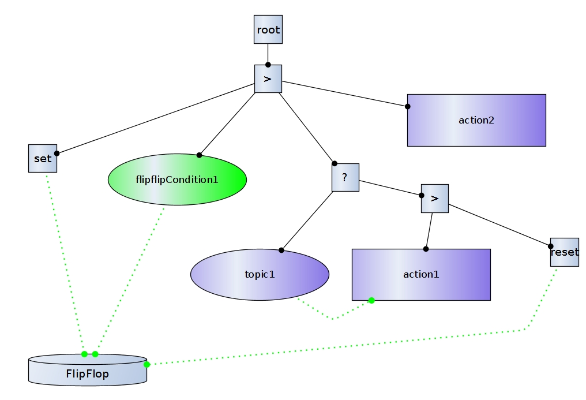

### Why a behavior tree

> The main advantage of BTs compared to FSMs is their modularity, as can be seen by the following programming language analogy. In FSMs, the state transitions are encoded in the states themselves, and switching from one state to the other leaves no memory of where the transition was made from, a so-called one way control transfer. This is very general and flexible, but actually very similar to the now obsolete GOTO command, that was an important part of many early programming languages, e.g., BASIC. In BTs the equivalents of state transitions are governed by calls and return values being passed up and down the tree structure, i.e. two way control transfers. This is also flexible, but more similar to the use of function calls, that has replaced GOTO in almost all modern programming languages. Using function calls when programming made it much easier to modularize the code, which in turn improved readability and reusability. Thus, BTs exhibit many of the advantages in terms of modularity (including readability and reusability) that was gained when going from GOTO to function calls in the 1980s. Note however, that there are no claims that BTs are superior to FSMs from a purely theoretical standpoint.
> -- <cite>[Michele Colledanchise - A Behavior Tree Library in C++ User Manual][1]</cite>

[1]:https://github.com/miccol/Behavior-Tree/blob/master/BTppUserManual.pdf


### How does it work

The behavior tree is a directed tree with nodes and edges using the usual definition of parents and
children for neighboring nodes whereby the node without parents is called the root
node, and nodes without children are called leaf nodes. These Nodes are separated into 2 categories, control nodes for flow control of the behavioral pattern and leaf nodes for executional patterns.
Upon execution of the behavior tree, each time step of the control loop, the root node is ticked. This tick is then cascaded down the tree according to the types of each node. Once a tick reaches a leaf node (Action or Condition), the node does some computation, possibly affecting some continuous or discrete states/-variables of the behavior tree, and then returns either Success, Failure or Running. The return status is then progressed up the tree, back towards the root, according to the types of each node. If a running node does no longer receive a tick, it has to stop (preempted). The stopping of a preempted action is implemented in this library by the halt procedure.

  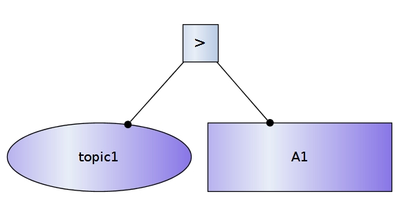

#### Events
Multiple events are used to control the behavioral flow of a behavior tree. The most important, the "tick", resides inside the tick-engine as a clock signal for each and every existing node inside the given tree structure. Other signals are implemented (and can be further expanded upon) if new requirements have to be met regarding the relatively simple approach of the tree to make it more robust, more approachable or more complex.

##### Ticks
The tick engine itself consists of a clock and reset mechanism. It triggers 3 signals:

1. PreTick
    Triggered from a parent before a child would be ticked
2. Tick
    The actual Tick itself, used as a clock signal to execute and apply certain functionality
3. PostTick
    Triggered from a parent after a child tick was executed and processed


##### Hooks

The hook engine is a node based execution event, which is not directly triggered by the behavior tree itself. Hooks are a simple way for nodes to communicate and relay information regarding their given task. From an outside perspective, these hooks would behave very much like a graphical programming language (for example: matlab/simulink). They are designed like special edges inside the tree, which are interpreted by their respective nodes (as they please) and can trigger multiple internal events.
At the moment only a boolean value communication was chosen and implemented (to keep it simple, but any other data structure is possible):

* Set
   A source can trigger this event inside a target to set a value on target to something new. The target decides which value to set or what it wants to do with this value based on the source or it's own internal state.
* Get
   A source can trigger this event inside a target to fetch a value and then use it for itself. The target decides which value to give or what it wants to do with this event based on the source or it's own internal state.
* Reset
   A source can trigger this event inside a target to reset it. A reset in this context is defined by the target node itself.
   

As described later, hooks can either be called (hook source) or supplied (hook sink), which defines if the node applies (transmit) the hook event onto other nodes or if the node wants to get called with a specific hook event (receive).

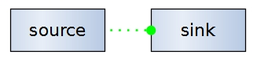


#### Internal Structures

As described earlier there are multiple nodes, which can be used to implement your desired design. The different categories define whether or not the node has children (and therefore controls flow) or doesn't have children (and therefore controls execution). All the specific nodes are derived from their respective categories(control_node, leaf_node), which have a common base class (tree_node).

##### Base
* tree_node
   base class implementation , containing every event call (mostly abstract virtual)
    * control_node
    * leaf_node
   
##### Control Nodes

* sequence_node
   Sequence nodes are used to find and execute the first child that has not yet succeeded. A sequence node will return immediately with a status code of failure or running when one of its children returns failure or running. The children are ticked in order, from left to right. The sequence node is graphically represented by a box with an arrow.
   

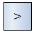

* fallback_node
   Fallback nodes are used to find and execute the first child that does not fail. A fallback node will return immediately with a status code of success or running when one of its children returns success or running. The children are ticked in order of importance, from left to right. The selector node is graphically represented by a box with a question mark.

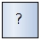

* parallel_node
   The parallel node ticks its children in parallel and returns success if all children return success, it returns failure if 1 child returns failure, and it returns running otherwise. It will also wait for the execution of all children instead of aborting early if a child failed. The parallel node is graphically represented by a box with two arrows.

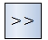

* sequence_node_with_memory
   This node behaves exactly like it's non-memory equivalent, but it will remember it's child states, meaning that it will not trigger a already finished child again. This memory is cleared after the last child has finished successfully or a single child failed.

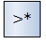

* fallback_node_with_memory
   This node behaves exactly like it's non-memory equivalent, but it will remember it's child states, meaning that it will not trigger a already finished child again. This memory is cleared after the last child has failed or a single child succeeds.

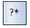

 * false_node
   This node just returns the failure result to it's parent tree node. Especially useful for error branches which should return false from a logic perspective, but don't actually return failure(false) because theses branches do some actions (error handling) which actually do something useful and could return success (true).

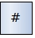
         
##### Leaf Nodes

There are two major types of leaf nodes:

1. condition_node
   A Condition node determines if a condition C has been met. Conditions are technically a subset of the Actions, but are given a separate category and graphical symbol to improve readability and emphasize the fact, that they never return running and do not change any internal states/variables of the behavior tree.

    * sts_bt_if_topic
    This node behaves like a normal condition, but it will receive it's state from an external source/system via a ros topic. It uses 2 input buffers to secure synchronization of asynchronous data (distributed system) and a single enable latch to detach it's internal buffer from the behavior tree (block it's signal = disable)
         * Special Features: 
           The name of this node is also the rostopic used
           This node can invert it's output when the first symbol of it's name is a '!'
         * Hook Source:
           Get: Fetches enable signals(bool) to identify whether or not the condition will return (Tick Event) it's newest internal state or return it's last stable (enabled) one
   
    * sts_bt_if_service
    This node behaves like a normal condition, but it will receive it's state from an external source/system via a ros service client. It works asynchronous by design and will therefore block the execution of the behavior tree (so be careful on the ros node side)
         * Special Features: 
           The name of this node is also the rosservice used
           This node can invert it's output when the first symbol of it's name is a '!'

    * condition_node_hook
    This node behaves like a normal condition, but it will get it's value from a hooked partner via the hook GET event on Tick.
	    * Special Features: 
	 This node can invert it's output when the first symbol of it's name is a '!'
	     * Hook Source:
	 Get: Fetches value(bool)  to return success or failure.
	

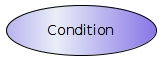

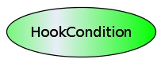


2. action_node
   An Action node performs an action, and returns Success if the action
is completed, Failure if it can not be completed and Running if completion is
under way.

    * sts_bt_if_action
    This node behaves like a normal action, but it will send parameters and receive it's state from an external source/system via a ros action client. If halted via the behavior tree, this action will return running state as long as the action of the communication partner has not acknowledged this abort (ros: cancelGoal) signal.
         * Special Features: 
           The name of this node is also the ros action used
   
       

 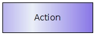      
       

##### Support Nodes
Support nodes are not directly part of the tree. They exist as a data holders or single tick event triggers and are only ever reacting with other nodes when they are hooked properly.

* flip_flop_node
   This node reserves a single booelan value as memory, which can be written or read via hooks.
    * Hook Sink:
         Get: returns the memory value(bool)
         Set: sets the memory value(bool)
         Reset: sets the memory value(bool) to it's preferred default value (default: false)

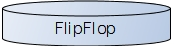


* set_node
   This node just sends a SET hook event to all its hooked children on Tick.
    * Hook Source:
         Set: just set something

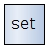

 * reset_node
   This node just sends a RESET hook event to all its hooked children on Tick.
    * Hook Source:
         Reset: just reset something

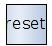


### How to use it
The behavior tree can be executed by creating a tree, either by parsing a .graphml or creating it yourself in code, and then executing that tree.

#### Building Trees
##### Parser / yEd .graphml

Building trees from scratch is lame, so we designed a .graphml parser which can be used to create a well documented graph and use it as a recipe for the behavior tree creation itself.

The package [sts_bt_main](http://gitlab_al.streetscooter.eu/al_SW_Team/sts_bt_main) and sts_behavior_tree_testing have an example tree in their configs which contain the necessary behavior tree building blocks in [yEd](https://www.yworks.com/products/yed).

**How to set up yEd**

yEd (v3.19.1.1) sadly cannot put data fields (which are used to identify and differentiate the nodes in the graph) in palettes because custom data fields are a file-specific attribute. Because of this, you have to import the palette and re-add custom data fields in your custom behavior_tree.graphml file.  A List of data fields used for parsing the .graphml can be seen below.

* import palette
  * Edit > Manage Palette > Import Section > Choose your Palette file from `sts_behavior_tree_testing/sts_behavior_tree_server/config/behaviorTree_palette.graphml`
* Add custom data fields
  * Edit > Manage Custom Properties > Add the following to the lists:
    * Node Properties
      * bt_type
      * bt_function
    * Edge Properties
      * bt_connection

**Remember this when using .graphml** 

All the (above) described elements of the behavior tree should be inside the palette (.graphml). You should keep the following in mind when using yEd (.graphml) to design your behavior tree:

* x(horizontal) positioning matters.
    * When a parent has 2 or more children, these will be ordered from left to right as designed in the graph itself (using the x coordinate of every child)
* Edge direction (source/target on normal and hook edges) matters.
    * Draw edges from source to sink or from parent  to child
    * When doing it the wrong way, your tree will likely be a confusing mess
* Data fields matter.
    * To differentiate the different attributed building blocks of the tree, nodes and edges have different data fields (which sadly can not be set to a default in yEd) which have to be set correctly in order for the tree parser to work properly.
    * A list of the relevant types will be shown in this section 
    * An exception to this rule is the normal tree edge, which does not have to be set with a data field, because every edge will be parsed as a tree edge by default.
    * Another exception to this rule is the hook edge line, which does not have to be set with a data field, because every dotted line with THAT SPECIFIC edge type (dotted line) will be parsed as a hook edge by default. 
* root matters.
    * The root node is the entry-point for the tree, later multiple roots can be implemented and parsed for better usability of multiple sub trees(NOT IMPLEMENTED YET). 
    * Every node which is not part of the root node network will be parsed but not used in execution.


**List of used data fields for .graphml for nodes:**

* bt_type
    * root
    * sequence
    * fallback
    * parallel
    * decorator
    * sequence_memory
    * fallback_memory
    * condition
    * action
    * function

* bt_function
    * topic
    * service
    * action
    * flipflop
    * set
    * reset
    * hook
    
    

List of used data fields for .graphml for edges:

* bt_connection
    * hook


Using the parser inside the code should be straightforward:

```
BT::TreeNode* rootPtr = sts_behavior_tree::BehaviorTree::Load(path, nh);
```

* **path**: String (absolute) path to the .graphml file
* **nh**: Takes a ros nodeHandle pointer to use with ros communication.


##### From Scratch (Code)
```
	//Build nodes here
	StsBtIfNodePtr action1 = sts_bt_if_factory::createNode("/sts_behavior_tree_testing_node/bt_action", 
		false, sts_bt_if_factory::ACTION, nodeHandle, false);
	StsBtIfNodePtr condition1 = sts_bt_if_factory::createNode("/sts_behavior_tree_testing_node/bt_topic", 
		true, sts_bt_if_factory::TOPIC, nodeHandle,false);
	StsBtIfNodePtr condition2 = sts_bt_if_factory::createNode("/sts_behavior_tree_testing_node/bt_service", 
		true, sts_bt_if_factory::SERVICE, nodeHandle, false);
	BT::SequenceNode* root = new BT::SequenceNode("root", true);
	BT::FallbackNode* condition_branch = new BT::FallbackNode("condition_branch", true);
	BT::SequenceNode* action_branch = new BT::SequenceNode("action_branch", true);
        //Build tree here
	root->AddChild(condition_branch);
	root->AddChild(action_branch);
	condition_branch->AddChild(condition1);
	condition_branch->AddChild(action1);
	action_branch->AddChild(condition2);
```

Normal nodes behave quite simple and don't need many arguments at creation:

* **id**: Global identifier of the control node which is unique
* **name**: Local identifier of the control node which is shown in visualization and used for ros naming.


The nodes interacting with ros are a little bit more complicated:


* **id**: Global identifier of the control node which is unique
* **name**: Local identifier of the control node which is shown in visualization and used for ros naming.
* **condition**: Decides if the leaf node is created as condition(true) or action(false) node
* **comType**: Takes an enum value. Decides on the communication channel to use ```enum comTypeEnum{TOPIC, SERVICE, ACTION}```.
* **nh**: Takes a ros nodeHandle pointer to use with ros communication.
* **errorDefault**: Specifies the default return value which is used in case of ros communication issues.


#### Starting Trees
The tree starts with the ```Execute()``` call and will run forwever. It takes a ```TreeNode*``` pointer to the root of your tree and executes from there.

```
try
{
	sts_behavior_tree::BehaviorTree::Execute(this->rootPtr, 
		this->treeTickPeriod_, id, this->nodeHandlePtr, this->nodename_,
		this->treeGenFeedback_, this->treeDebugDelay_);
}
catch (BT::BehaviorTreeException& Exception)
{
	this->PRINT_ERROR( Exception.what ( ));
}
```

* **root**: Pointer to the root node.
* **cycletime**: Cycletime in which the root is getting ticked.
* **id**: Empty feedback reference which is used to broadcast the last called element of the in the latest cycle.
* **nh**: Nodehandle of this node. Used to create the feedback publisher.
* **nodeName**: Name of this node to create a proper feedback topic.
* **feedback**: Bool if you want to publish the feedback after every cycle.


### How to interface it (Virtual Interfaces API)

Interfacing from user (node) perspective is done via the special interface for the behavior tree inside the [sts_virtual_interfaces package](http://gitlab_al.streetscooter.eu/al_SW_Team/sts_virtual_interfaces). All you have to do is to declare the communication endpoints in your node and the interface will create and (mostly) maintain these interfaces for you.

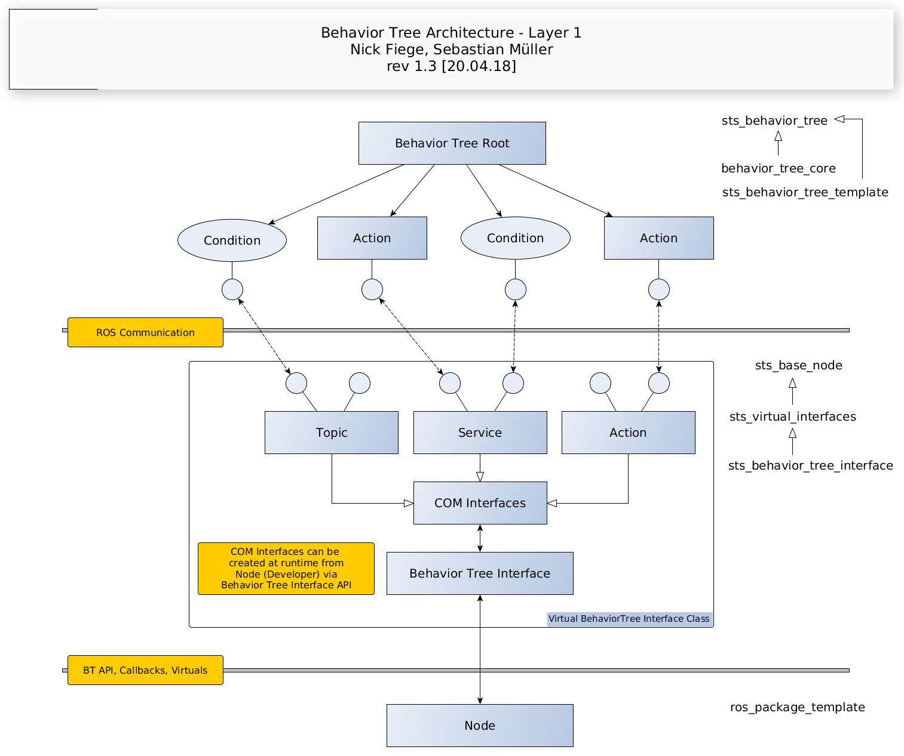

### Additional Information

A example of the possible ros communications and their messaging can be seen here:

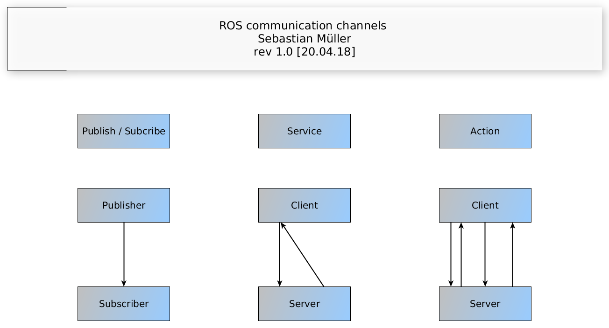 